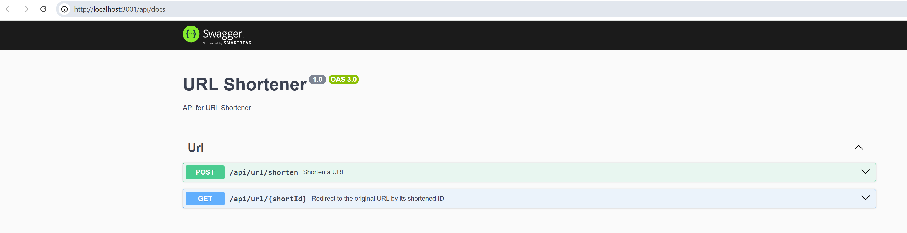

# URL Shortener

## Prerequisites

Before starting the application, make sure you have:

- **Node.js** installed
- **MongoDB** installed locally or as a Docker container

## Start MongoDB Database

### Option 1: Install MongoDB Manually

Follow the official documentation: [MongoDB Installation Guide](https://www.mongodb.com/docs/manual/installation/)

### Option 2: Use Docker (Recommended Method)

If you have **Docker** installed, you can easily start a MongoDB container with the following commands:

```sh
# Pull the MongoDB image
docker pull mongo

# Start a MongoDB container
docker run -d --name mongo -p 27017:27017 mongo
```

---

## Start the Application in Development Mode

### Backend

```sh
cd url-shortener-be
npm install
npm start
```

The backend starts by default on **port 3001**.
You can access the API documentation here:
👉 [http://localhost:3001/api/docs](http://localhost:3001/api/docs)


### Frontend

```sh
cd url-shortener-fe
npm install
npm start
```

The frontend starts by default on **port 3000**.
👉 [http://localhost:3000](http://localhost:3000)

---

## Launch the Application with Docker Compose

You can use **Docker Compose** to launch the complete application with a single command:

```sh
docker-compose up -d
```

---

## Implementation Overview

### API Endpoints

| Method | Endpoint            | Description                                      |
|--------|---------------------|--------------------------------------------------|
| POST   | `/api/url/shorten`  | Accepts a long URL and returns a short URL.      |
| GET    | `/api/url/:shortId` | Accepts a short ID and returns the original URL. |

---

## Unit Tests

### Backend Unit Tests (Jest)

- **`encryption.service.spec.ts`**: Validates URL encryption functionality.
- **`url.service.spec.ts`**: Tests URL shortening and retrieval logic.

### Frontend End-to-End Tests (Vitest)

- **`page.test.tsx`**: Ensures correct rendering and interactions on the page.

---

## Using the Application

1. Enter a long URL in the input field.
2. Click **Shorten URL**.
3. A shortened URL is generated with multiple options:
    - **Visit**: Navigate to the shortened URL.
    - **Share**: Share the link.
    - **QR Code**: Generate a QR code for easy scanning.
    - **Copy**: Copy the URL to the clipboard.
    - **Clear**: Reset the interface.

### Activity Tracking

- Navigation activities of shortened URLs are recorded in the database.
- The original URL is **encrypted** before storage to protect user privacy.

---

## Deployment

The application is hosted on a **VPS** and accessible at: ⚡ [https://vps-569a04f1.vps.ovh.net/](https://vps-569a04f1.vps.ovh.net/)⚡

### Stack & Infrastructure
- **Docker & Docker Compose** for containerized deployment.
- **Nginx** as a reverse proxy.
- **Certbot (Let's Encrypt)** for automated SSL.
- **Isolated Docker network** for secure inter-service communication.
- **Persistent volumes** for data storage.
- **Centralized logging & monitoring** via Docker logging drivers.

---

🚀 **Enjoy the URL Shortener!**

